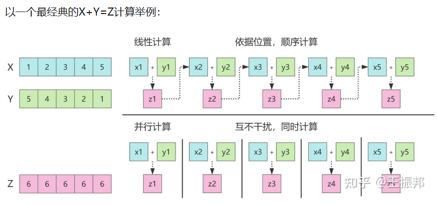
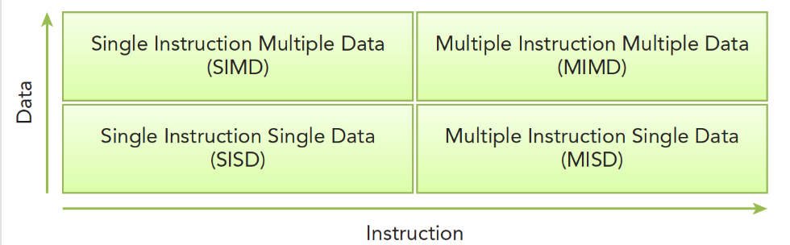
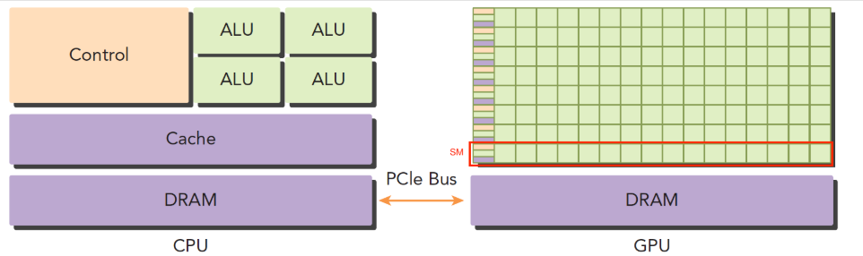
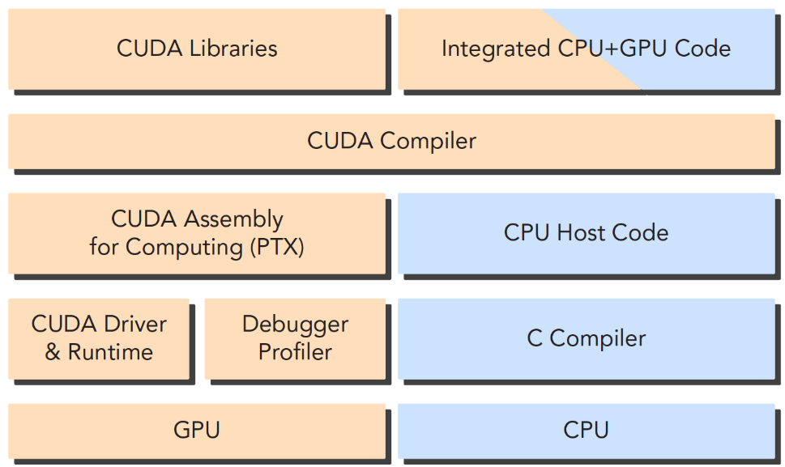
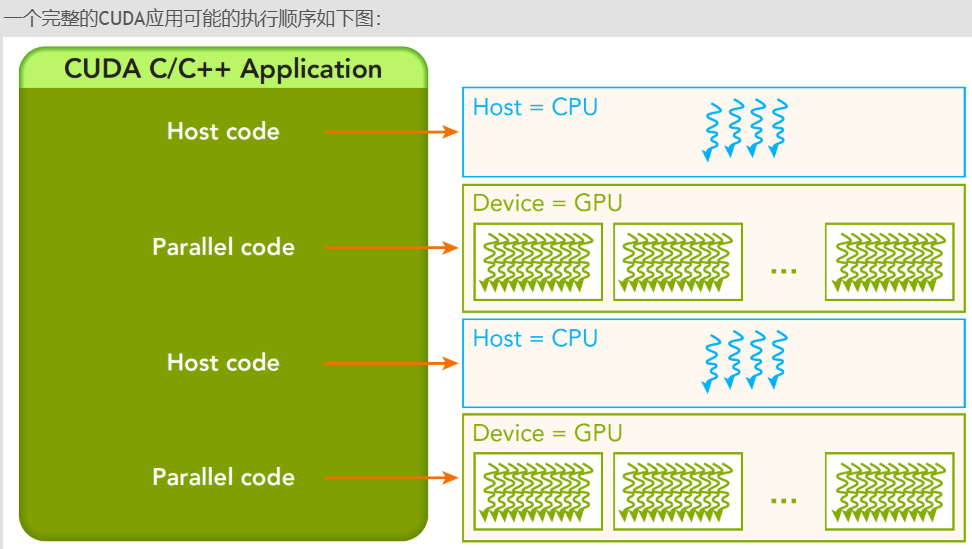
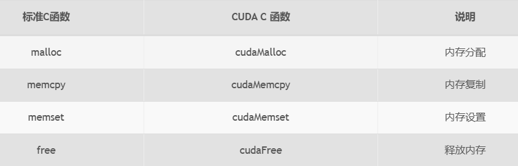
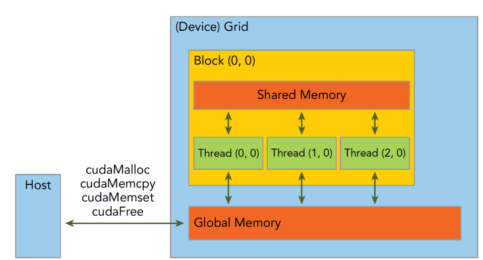

# 第一章  概述
## 1.1  并行计算
### 1.1.1  并行计算是什么？

### 1.1.2  并行计算的分类与数据划分
- 数据并行
  - CUDA编程适合解决数据并行计算问题
- 核心难点
  - 如何合理划分数据使得最大程度利用硬件进行计算
- 数据划分方法
  - 块划分
    - 把一整块数据切成小块，每个小块随机的划分给一个线程，每个块的执行顺序随机
  - 周期划分
    - 线程按照顺序处理相邻的数据块，每个线程处理多个数据块
## 1.2  计算机架构
### 1.2.1  佛林分类法Flynn’s Taxonomy

### 1.2.2  根据内存划分
- 分布式内存的多节点系统(计算集群)
- 共享内存的多处理器系统
  - 注意：常说的多核处理器中的“核”指的是ALU而非CPU
# 第二章  异构计算与CUDA
- 
  - CPU可被看作：host，主机端
    - 主机端运行主机代码，主要进行控制类工作
  - GPU可被看作：device，计算设备
    - 计算设备运行设备代码，主要进行计算类工作
- GPU计算能力分析
  - 容量特征
    - CUDA核心(越多越好)
    - 内存大小
  - 性能指标
    - 峰值计算能力
    - 内存带宽
- CPU与GPU的区别
  - CPU
    - 常用于运行低并行逻辑复杂的程序
    - CPU线程是重量级实体，操作系统交替执行线程，线程切换有一定的开销
  - GPU
    - 常用于运行高并行逻辑简单的数据计算
    - GPU线程是轻量级实体，线程之间切换基本没有开销
- CUDA(Compute Unified Device Architecture)
  - CUDA不单指软件或硬件，而是建立在Nvidia GPU上的一整套平台，并扩展出多语言支持
  - CUDA库本身提供了大量API来操作设备完成计算(不可混合调用，只能使用其中一个库)
    - CUDA驱动API(低级)
    - CUDA运行时API(高级，基于低级)
  - CUDA应用通常被分解为两部分(由CUDA NVCC编译器自动分离)
    - CPU主机端代码
    - GPU设备端代码(核函数)
    - 
  - CUDA程序的常见步骤
    - 分配GPU内存
    - 拷贝数据到设备
    - 调用CUDA核函数执行计算
    - 姜计算结果拷贝回主机端
    - 销毁内存
# 第三章  CUDA编程模型概述
## 3.1  CUDA应用开发层次
- 领域层
  - 分析问题的数据与函数
- 逻辑层
  - 编程以便组织并发线程
- 硬件层
  - 通过理解线程如何映射到机器上，能充分帮助我们提高计算性能
## 3.2  CUDA编程结构

## 3.3  内存管理
- 
- 最关键的API之——`cudaError_t cudaMemcpy(void* dst,const void* src,size_t count,cudaMemcpyKind kind)`
  - 该函数为内存拷贝过程，可以完成以下几种过程(cudaMemcpyKind kind)
    - cudaMemcpyHostToHost
      - Host内拷贝
    - cudaMemcpyHostToDevice
      - Host到Device的拷贝
    - cudaMemcpyDeviceToHost
    - cudaMemcpyDeviceToDevice
  - 返回
    - 执行成功：`cudaSuccess`
    - 执行失败：`cudaErrorMemoryAllocation`
  - 翻译错误代码
    - `char* cudaGetErrorString(cudaError_t error)`
- 内存层次图(简易)
  - 
## 3.4  线程管理
## 3.5  核函数
## 3.6  错误处理
