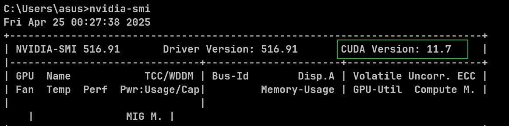
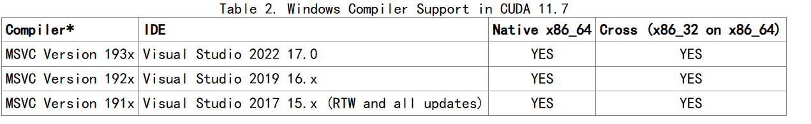

# 一、安装前需要知道的配置信息
- 电脑支持的最高CUDA版本
  - 打开命令行，输入`nvidia-smi`即可显示支持的CUDA最高版本
  - 
- 当前Visual Stdio版本
  - 我的是Visual Stdio17.11.5【不符合官网要求的CUDA11.7所支持的版本】
    - 
- 电脑操作系统版本
  - 我的是Win 11
# 二、安装
## Visual Stdio2019安装
- 因为CUDA11.7的支持，我选择安装Visual Stdio2019版本【可在网上寻找安装资源】
## CUDA安装
- 进入[官网下载界面](https://developer.nvidia.com/cuda-toolkit-archive)
  - 切记，下载的CUDA Toolkit不能高于最高版本号
- 选择支持版本
  - CUDA11.7
- 下面的步骤进行默认安装即可